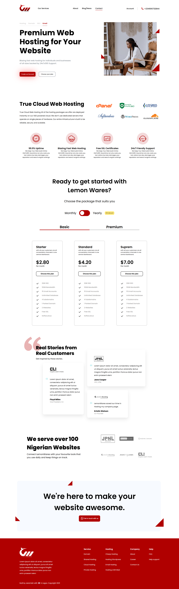

# Hosting Landing Page

A responsive hosting website landing page built by converting a Figma design into clean HTML, CSS, and JavaScript.

## 📸 Preview



## 🚀 Live Demo

https://figma-to-html-hosting-website.netlify.app/

## 🎨 Design Credit

Design sourced from Figma Community.

- Figma User: @ramsriperambudr  
- Original credit (as mentioned in design): Jeremiah

Figma File: https://www.figma.com/design/K7XQf6kCNfmh8268qbL0dG/Landing-page-for-Hosting-Company--Community-?node-id=2-41&t=3kbjUJfITddMBcIT-0

> Note: This project is a frontend implementation for learning and practice purposes only. All design credits belong to the original designer.

## 🛠️ Tech Stack

- HTML5
- CSS3 (Flexbox, Grid, Responsive Design)
- JavaScript (DOM manipulation, active states, mobile menu)
- AOS (Animate On Scroll library)

## ✨ Features

- Fully responsive layout (mobile, tablet, desktop)
- Interactive navigation with active state
- Hamburger menu for smaller screens
- Pricing section with tabs/toggle
- Smooth scroll animations using AOS

## 📚 What I Learned

* Converting Figma designs into real-world layouts
* Building responsive UI using Flexbox and Grid
* Managing UI states with JavaScript
* Structuring reusable and clean CSS

## 📂 Project Structure

```
├── index.html
├── style.css
├── script.js
├── images/
```

## ⚠️ Disclaimer

This project is not an original design. The UI/UX design is owned by the respective designer. This is only a frontend implementation.
